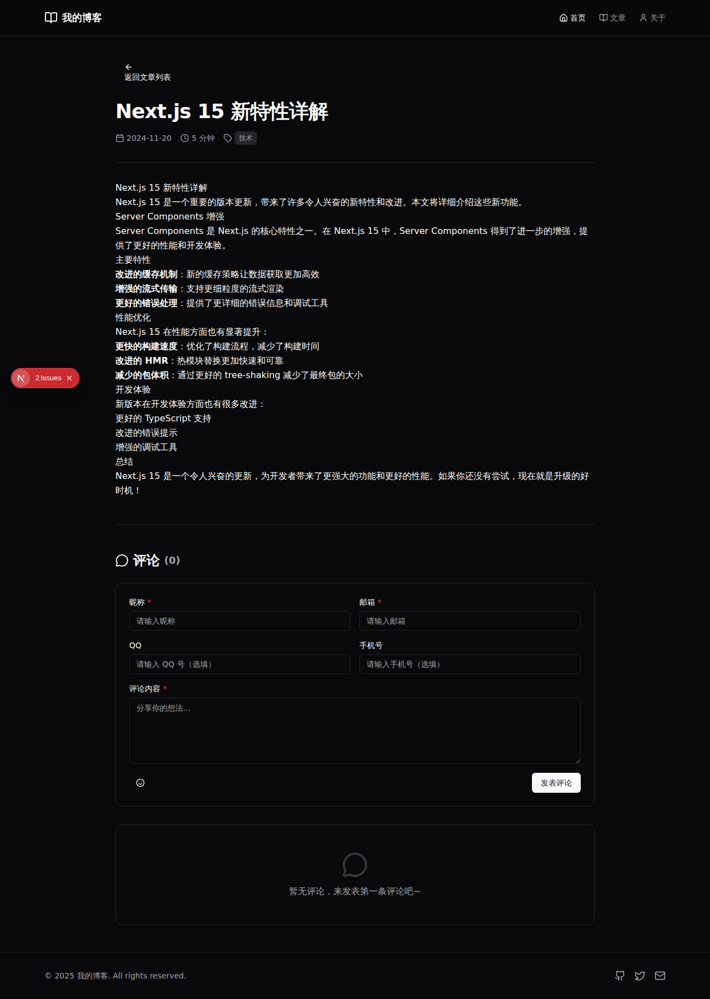

# 评论系统

## 功能概述

本博客实现了完整的评论功能，支持用户在文章底部发表评论。评论系统具有以下特性：

### 核心功能

1. **评论表单**
   - 必填字段：昵称、邮箱
   - 选填字段：QQ号、手机号
   - 支持文本和 Emoji 表情
   - 不支持图片、视频等文件上传

2. **用户信息缓存**
   - 用户首次填写信息后，会自动保存到浏览器本地存储（localStorage）
   - 再次评论时会自动填充用户信息，避免重复输入

3. **评论列表**
   - 显示所有评论，最新评论在上面
   - 区分作者和普通用户（作者显示皇冠图标和"作者"标签）
   - 显示评论时间（智能时间格式：刚刚、X分钟前、X小时前、X天前等）
   - 显示总评论数

4. **Emoji 选择器**
   - 提供120多个常用 Emoji 表情
   - 点击即可插入到评论内容中
   - 支持在光标位置插入

## 技术实现

### 数据存储

使用浏览器 localStorage 存储评论数据和用户信息：
- `blog_comments`: 存储所有评论
- `blog_user_info`: 存储用户信息（昵称、邮箱、QQ、手机号）

### 组件架构

1. **CommentSection** (`src/components/comment-section.tsx`)
   - 主评论区组件
   - 管理评论列表状态
   - 显示评论总数

2. **CommentForm** (`src/components/comment-form.tsx`)
   - 评论表单组件
   - 表单验证
   - 用户信息缓存加载和保存

3. **CommentList** (`src/components/comment-list.tsx`)
   - 评论列表组件
   - 区分作者和用户
   - 时间格式化

4. **EmojiPicker** (`src/components/emoji-picker.tsx`)
   - Emoji 选择器组件
   - 弹出式面板
   - 支持120多个表情

### 类型定义

```typescript
interface Comment {
  id: string;
  postId: string;
  nickname: string;
  email: string;
  qq?: string;
  phone?: string;
  content: string;
  createdAt: string;
  isAuthor: boolean;
}
```

## UI 组件

新增了以下 UI 组件：
- **Input** (`src/components/ui/input.tsx`) - 输入框组件
- **Textarea** (`src/components/ui/textarea.tsx`) - 文本域组件

## 表单验证

- 昵称：不能为空
- 邮箱：不能为空，必须符合邮箱格式
- 评论内容：不能为空
- QQ 和手机号：可选，不做格式验证

## 使用方式

评论功能已集成到文章详情页 (`src/app/posts/[id]/page.tsx`)，自动显示在文章内容下方。

## 截图



## 未来改进方向

1. 添加评论回复功能
2. 添加评论点赞功能
3. 支持 Markdown 格式
4. 添加评论举报功能
5. 支持管理员删除评论
6. 添加后端 API 支持，实现真正的数据持久化
